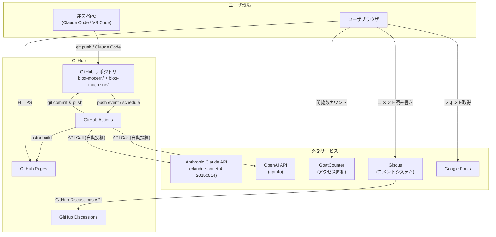
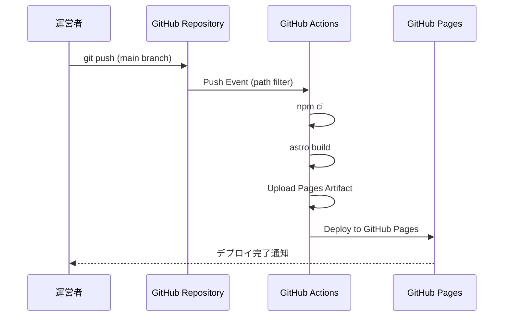
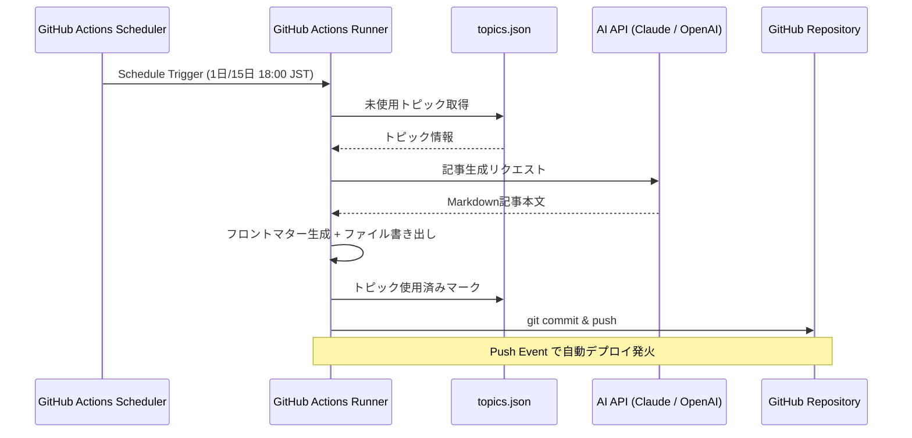
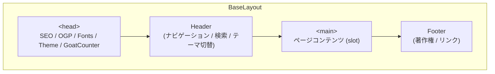

# 基本設計書: パーソナル技術ブログシステム

---

## 1. ドキュメント情報

| 項目 | 内容 |
|------|------|
| ドキュメント名 | パーソナル技術ブログシステム 基本設計書 |
| バージョン | 1.0.0 |
| 作成日 | 2026-03-02 |
| 最終更新日 | 2026-03-02 |
| 作成者 | システム開発担当 |
| 承認者 | --- |
| 分類 | 社内評価用設計ドキュメント |
| 管理番号 | BD-BLOG-2026-001 |

### 改訂履歴

| バージョン | 日付 | 変更内容 | 担当者 |
|-----------|------|---------|--------|
| 1.0.0 | 2026-03-02 | 初版作成 | システム開発担当 |

---

## 2. システム概要

### 2.1 目的

本システムは、IT技術に関するナレッジを体系的に蓄積・発信するためのパーソナル技術ブログ基盤である。静的サイトジェネレータ (Astro) を採用し、GitHub Pages 上でホスティングすることで、サーバ運用コストをゼロに抑えつつ、高速・安全・保守性の高いブログシステムを実現する。

加えて、AI API (Claude API / OpenAI API) と GitHub Actions のスケジュール実行を組み合わせた自動投稿機能を備え、継続的なコンテンツ生成を半自動化する点が本システムの特徴である。

### 2.2 スコープ

本設計書が対象とするシステムの範囲は以下の通りである。

- **Blog Modern**: テック・ダークテーマを基調としたブログバリアント
- **Blog Magazine**: エディトリアル・ウォームテーマを基調としたブログバリアント
- **AI 自動投稿基盤**: Claude API / OpenAI API を用いた記事自動生成パイプライン
- **CI/CD パイプライン**: GitHub Actions によるビルド・デプロイ自動化
- **配布物管理**: スクリプト・テンプレート等のダウンロード提供機能

### 2.3 対象ユーザ

| ユーザ種別 | 説明 |
|-----------|------|
| 閲覧者 | 技術記事を閲覧する一般ユーザ (主に IT 未経験の新卒エンジニア、若手エンジニア) |
| 運営者 | ブログ記事の作成・管理・配布物の登録を行う管理者 (1名) |
| AI Bot | GitHub Actions 上で自動的に記事を生成・コミットするシステムユーザ |

### 2.4 前提条件

- GitHub リポジトリでソースコードおよびコンテンツを一元管理する
- GitHub Pages の静的サイトホスティングを利用する (サーバサイド処理なし)
- 運営者はローカル開発環境として Node.js 22 以上を使用する
- AI 自動投稿には Anthropic API Key または OpenAI API Key が必要である

---

## 3. システム構成図

### 3.1 全体アーキテクチャ



### 3.2 デプロイフロー



### 3.3 AI 自動投稿フロー



---

## 4. 技術スタック

### 4.1 コア技術

| 技術 | バージョン | 用途 | 選定理由 |
|------|-----------|------|---------|
| Astro | 5.17.x | 静的サイトジェネレータ | Islands Architecture による優れたパフォーマンス。Content Collections によるコンテンツ管理。View Transitions API 対応 |
| TypeScript | 5.x (Astro 内蔵) | 型安全な開発 | スキーマ定義 (Zod) との親和性、開発体験の向上 |
| Tailwind CSS | 4.2.x | ユーティリティファーストCSS | Vite プラグインによる高速ビルド。@tailwindcss/vite による v4 ネイティブ統合 |
| MDX | @astrojs/mdx 4.3.x | 拡張 Markdown | Markdown 内でコンポーネントを利用可能。Content Collections との統合 |

### 4.2 ホスティング・CI/CD

| 技術 | バージョン | 用途 | 選定理由 |
|------|-----------|------|---------|
| GitHub Pages | --- | 静的サイトホスティング | 無料、HTTPS 標準対応、GitHub Actions との統合 |
| GitHub Actions | v4 (各アクション) | CI/CD | リポジトリ一体型のワークフロー管理。cron スケジュール対応 |
| Node.js | 22.x | ビルドランタイム | Astro 5.x の推奨バージョン。LTS |

### 4.3 機能拡張

| 技術 | バージョン | 用途 | 選定理由 |
|------|-----------|------|---------|
| Pagefind | 最新 | 全文検索 | 静的サイト専用の軽量検索エンジン。ビルド時にインデックス生成 |
| Giscus | 最新 | コメントシステム | GitHub Discussions ベースでデータベース不要。テーマ連動対応 |
| GoatCounter | 最新 | アクセス解析 | プライバシー重視の軽量アナリティクス。Cookie 不使用 |
| @astrojs/rss | 4.0.x | RSS フィード生成 | Astro 公式パッケージ。Content Collections 対応 |
| @astrojs/sitemap | 3.7.x | サイトマップ生成 | SEO 向上。Astro 公式パッケージ |
| Shiki | Astro 内蔵 | シンタックスハイライト | github-light / github-dark デュアルテーマ対応 |
| Google Fonts | --- | Web フォント | Blog Modern: Inter + JetBrains Mono / Blog Magazine: Playfair Display + Source Sans 3 |

### 4.4 AI 自動投稿

| 技術 | バージョン | 用途 | 選定理由 |
|------|-----------|------|---------|
| Anthropic Claude API | 2023-06-01 | 記事自動生成 (プライマリ) | 日本語の自然な文章生成能力。claude-sonnet-4-20250514 モデル使用 |
| OpenAI API | Chat Completions v1 | 記事自動生成 (フォールバック) | Claude API 障害時の代替。gpt-4o モデル使用 |
| tsx | 最新 | TypeScript スクリプト実行 | generate-post.ts の直接実行。コンパイル不要 |

---

## 5. 機能仕様

### 5.1 記事管理

#### 5.1.1 Content Collections によるコンテンツ管理

Astro Content Collections を用いて、Markdown / MDX ファイルによるコンテンツ管理を行う。コンテンツは `src/content/blog/` ディレクトリ配下に格納し、Zod スキーマによるフロントマターの型検証を行う。

**ブログ記事フロントマター仕様:**

```yaml
---
title: "記事タイトル"           # 必須: string
description: "記事概要"         # 必須: string
pubDate: 2026-03-02             # 必須: Date (coerce)
updatedDate: 2026-03-02         # 任意: Date (coerce)
heroImage: "/images/hero.png"   # 任意: string
tags: ["AI", "入門"]            # 任意: string[] (default: [])
category: "技術解説"            # 任意: string (default: "general")
draft: false                    # 任意: boolean (default: false)
aiGenerated: true               # 任意: boolean (default: false)
---
```

**コンテンツローダー設定:**

```typescript
loader: glob({ pattern: '**/*.{md,mdx}', base: './src/content/blog' })
```

#### 5.1.2 記事表示機能

- **記事一覧ページ**: グリッドレイアウト (3カラム) による記事カード表示
- **記事詳細ページ**: 本文表示、目次 (サイドバー)、読了時間表示、リーディングプログレスバー
- **関連記事**: タグの共通度に基づくスコアリングにより最大3件を自動表示
- **アーカイブ**: 年月別グルーピングによる時系列一覧
- **下書き機能**: `draft: true` の記事はビルド対象から除外
- **AI 生成表示**: `aiGenerated: true` の記事には「AI Generated」バッジを表示

#### 5.1.3 読了時間算出ロジック

日本語文章の読了速度を500文字/分として算出する。

```typescript
const wordsPerMinute = 500; // Japanese characters per minute
const charCount = content.replace(/\s+/g, '').length;
const minutes = Math.max(1, Math.ceil(charCount / wordsPerMinute));
```

### 5.2 タグ・カテゴリ

#### 5.2.1 タグ管理

- 各記事に複数タグを付与可能 (配列形式)
- タグ一覧ページでは全タグを記事数の降順で表示
- タグ別記事一覧ページでフィルタリング表示
- トップページにはタグクラウド (上位15件) を表示

#### 5.2.2 カテゴリ管理

- 各記事に1つのカテゴリを設定 (デフォルト: "general")
- 記事詳細ページのパンくずリストにカテゴリを表示
- カテゴリ一覧: 技術解説、AI 入門、ツール紹介、設計書、入門

### 5.3 検索機能 (Pagefind)

- **検索方式**: Pagefind による静的全文検索
- **インデックス生成**: `astro build` 時に自動生成 (`/pagefind/` ディレクトリ)
- **UI**: Pagefind UI コンポーネントを遅延読み込み (Lazy Load)
- **検索結果表示**: サブ結果 (showSubResults) 対応、画像サムネイル非表示
- **キーボードショートカット**: `Ctrl+K` / `Cmd+K` で検索ページへ遷移
- **エラーハンドリング**: インデックス未生成時にはフォールバックメッセージを表示

```javascript
new PagefindUI({
  element: '#search',
  showSubResults: true,
  showImages: false,
});
```

### 5.4 ダークモード / ライトモード

- **デフォルト**: ダークモード (`class="dark"`)
- **切替方式**: ヘッダーのトグルボタンによる手動切替
- **永続化**: `localStorage` に `theme` キーで保存
- **システム連動**: 初回アクセス時は `prefers-color-scheme` メディアクエリに従う
- **FOUC 防止**: `<head>` 内のインラインスクリプトでレンダリング前にクラスを適用
- **View Transitions 対応**: ページ遷移後も `astro:after-swap` イベントで状態を維持

### 5.5 コメント機能 (Giscus)

- **バックエンド**: GitHub Discussions
- **マッピング**: URL パス名 (`data-mapping="pathname"`)
- **入力位置**: 上部 (`data-input-position="top"`)
- **リアクション**: 有効 (`data-reactions-enabled="1"`)
- **テーマ**: ブラウザのカラースキーム設定に連動 (`data-theme="preferred_color_scheme"`)
- **言語**: 日本語 (`data-lang="ja"`)
- **読み込み方式**: 遅延読み込み (`data-loading="lazy"`)

### 5.6 RSS フィード

- **エンドポイント**: `/rss.xml`
- **タイトル**: TechBlog
- **説明**: AI・自動化・開発ツールに関する技術ナレッジを発信するブログ
- **言語**: ja (日本語)
- **コンテンツ**: 公開済み記事のタイトル、公開日、概要、URL、タグ (カテゴリ) を含む
- **生成方式**: `@astrojs/rss` パッケージによるビルド時生成

### 5.7 AI 自動投稿

#### 5.7.1 概要

GitHub Actions のスケジュール実行 (cron) および手動トリガー (workflow_dispatch) により、AI API を呼び出して記事を自動生成する。

#### 5.7.2 実行スケジュール

- **定期実行**: 毎月1日・15日の 09:00 UTC (18:00 JST)
- **手動実行**: GitHub Actions の workflow_dispatch から随時実行可能

#### 5.7.3 手動実行パラメータ

| パラメータ | 型 | 必須 | デフォルト | 説明 |
|-----------|------|------|-----------|------|
| blog | choice | Yes | modern | 対象ブログ (modern / magazine) |
| topic | string | No | (空) | 記事トピック (空の場合は自動選択) |
| provider | choice | Yes | claude | AI プロバイダ (claude / openai) |

#### 5.7.4 トピック管理

`scripts/topics.json` に記事トピック候補をプリセットとして管理する。自動投稿モード (`--auto`) では未使用のトピックを先頭から順に消費し、使用済みフラグ (`used: true`) を設定する。

**トピック定義スキーマ:**

```json
{
  "title": "記事タイトル",
  "category": "カテゴリ",
  "tags": ["タグ1", "タグ2"],
  "audience": "対象読者",
  "used": false
}
```

#### 5.7.5 フォールバック機構

プライマリ AI プロバイダの API 呼び出しが失敗した場合、自動的に代替プロバイダにフォールバックする。

```
Claude (プライマリ) → OpenAI (フォールバック)
OpenAI (プライマリ) → Claude (フォールバック)
```

#### 5.7.6 生成記事仕様

- **文字数**: 1,500 ~ 2,500 文字
- **文体**: 親しみやすい教育的トーン
- **構成**: `## はじめに` で開始、`## まとめ` で終了
- **コード例**: 適宜含む
- **フロントマター**: `aiGenerated: true` を自動付与
- **スラグ**: `YYYYMMDD-{hashSlug}` 形式で自動生成

#### 5.7.7 コミット・デプロイ

- **コミッタ**: `AI Auto Post <ai-bot@users.noreply.github.com>`
- **コミットメッセージ**: `feat: auto-generated blog post [ai-post]`
- **デプロイ**: main ブランチへの push により、パスフィルタに基づく自動デプロイが発火

### 5.8 閲覧数・ダウンロードカウント

#### 5.8.1 アクセス解析 (GoatCounter)

- **計測方式**: GoatCounter JavaScript スニペットによるページビュー計測
- **プライバシー**: Cookie 不使用、GDPR 準拠
- **スクリプト読み込み**: `<head>` 内で非同期読み込み
- **ダッシュボード**: GoatCounter 管理画面にて閲覧可能

#### 5.8.2 ダウンロードカウント

- ダウンロードリンク (`download` 属性付き `<a>` タグ) のクリックを GoatCounter のイベントトラッキングで計測可能
- ダウンロードカードコンポーネントに `data-file` 属性を付与し、トラッキングの識別子とする

### 5.9 配布物管理

#### 5.9.1 Content Collections スキーマ

`src/content/downloads/` ディレクトリ配下に Markdown ファイルで管理する。

```yaml
---
title: "ツール名"               # 必須: string
description: "説明"             # 必須: string
type: "tool"                    # 必須: enum (script | document | template | tool | game | site)
fileName: "file.zip"           # 必須: string
version: "1.0.0"               # 必須: string
pubDate: 2026-03-02             # 必須: Date (coerce)
tags: ["utility"]               # 任意: string[] (default: [])
fileSize: "2.4 MB"             # 任意: string
---
```

#### 5.9.2 配布物タイプ

| タイプ | ラベル | 説明 |
|--------|--------|------|
| script | Script | 実行可能なスクリプトファイル |
| document | Document | ドキュメントファイル |
| template | Template | テンプレートファイル |
| tool | Tool | ツール・ユーティリティ |
| game | Game | ゲーム関連ファイル |
| site | Website | Web サイトテンプレート等 |

#### 5.9.3 ダウンロード提供

- 実ファイルは `/public/downloads/` ディレクトリに配置
- ダウンロードカードから直接ダウンロードリンクを提供
- バージョン番号およびファイルサイズを表示

### 5.10 SEO 対策

#### 5.10.1 OGP (Open Graph Protocol)

全ページで以下の OGP メタタグを出力する。

| プロパティ | 値 |
|-----------|-----|
| og:type | website (一覧) / article (記事詳細) |
| og:title | `{ページタイトル} \| TechBlog` |
| og:description | ページ固有の説明文 |
| og:image | OG 画像パス (デフォルト: `/og-default.png`) |
| og:url | canonical URL |
| og:site_name | TechBlog |
| og:locale | ja_JP |

#### 5.10.2 Twitter Card

| プロパティ | 値 |
|-----------|-----|
| twitter:card | summary_large_image |
| twitter:title | ページタイトル |
| twitter:description | ページ説明文 |
| twitter:image | OG 画像パス |

#### 5.10.3 その他 SEO 要素

- **canonical URL**: 全ページで `<link rel="canonical">` を出力
- **sitemap.xml**: `@astrojs/sitemap` によるビルド時自動生成
- **RSS フィード**: `<link rel="alternate" type="application/rss+xml">` をヘッダーに出力
- **Generator メタタグ**: `<meta name="generator" content="{Astro.generator}">` を出力
- **言語設定**: `<html lang="ja">` を設定
- **構造化データ**: Markdown のセマンティックな見出し構造 (h1 > h2 > h3) を維持

---

## 6. 画面一覧

### 6.1 Blog Modern (テック・ダークテーマ)

| No. | 画面名 | ルート | 説明 | 主要コンポーネント |
|-----|--------|--------|------|-------------------|
| 1 | トップページ | `/` | ヒーローセクション、最新記事6件、タグクラウド、配布物プレビュー | HeroSection, ArticleCard, TagCloud |
| 2 | 記事一覧 | `/blog/` | 全公開記事のグリッド表示、タグクラウド | ArticleCard, TagCloud |
| 3 | 記事詳細 | `/blog/[...slug]/` | 記事本文、目次、共有ボタン、関連記事、コメント | BlogPost, TableOfContents, ShareButtons, Giscus |
| 4 | タグ一覧 | `/tags/` | 全タグの一覧表示 (記事数順) | TagCloud |
| 5 | タグ別記事 | `/tags/[tag]/` | 特定タグに属する記事の一覧 | ArticleCard |
| 6 | 配布物一覧 | `/downloads/` | ダウンロード可能ファイルの一覧 | DownloadCard |
| 7 | 検索 | `/search/` | Pagefind による全文検索 | PagefindUI (外部) |
| 8 | アーカイブ | `/archive/` | 年月別の記事時系列一覧 | --- |
| 9 | About | `/about/` | ブログ概要、運営者情報、技術スタック紹介 | --- |
| 10 | 404 | `/404/` | カスタム 404 エラーページ | --- |
| 11 | RSS | `/rss.xml` | RSS 2.0 フィード (XML) | --- |

### 6.2 Blog Magazine (エディトリアル・ウォームテーマ)

Blog Magazine は Blog Modern と同一のルーティング構成を持つ。ベースパスが `/blog-magazine/` に変更され、フォントおよびカラースキームが異なる。

| 差異項目 | Blog Modern | Blog Magazine |
|---------|-------------|---------------|
| ベースパス | `/blog-modern/` | `/blog-magazine/` |
| サイトタイトル | TechBlog | Tech Magazine |
| 見出しフォント | Inter (700/800) | Playfair Display (400/700) |
| 本文フォント | Inter (400/500/600) | Source Sans 3 (400/500/600/700) |
| 等幅フォント | JetBrains Mono | JetBrains Mono |
| デザイントーン | テック・ダーク | エディトリアル・ウォーム |

### 6.3 共通レイアウト構成



### 6.4 コンポーネント一覧

| コンポーネント | ファイル | 機能 |
|--------------|---------|------|
| Header | `components/Header.astro` | 固定ヘッダー、ナビゲーション、検索ボタン、テーマトグル、モバイルメニュー |
| Footer | `components/Footer.astro` | フッター、著作権表示 |
| HeroSection | `components/HeroSection.astro` | トップページのヒーローエリア、最新記事ハイライト |
| ArticleCard | `components/ArticleCard.astro` | 記事カード (タイトル、概要、日付、タグ) |
| TagCloud | `components/TagCloud.astro` | タグ一覧の表示 (記事数表示付き) |
| TableOfContents | `components/TableOfContents.astro` | 記事サイドバーの目次 (見出しベース) |
| ShareButtons | `components/ShareButtons.astro` | SNS 共有ボタン |
| BackToTop | `components/BackToTop.astro` | ページトップへ戻るボタン |
| DownloadCard | `components/DownloadCard.astro` | 配布物カード (タイプアイコン、バージョン、サイズ、DL ボタン) |

---

## 7. データ設計

### 7.1 Content Collections スキーマ定義

本システムはデータベースを持たず、Astro Content Collections によるファイルベースのデータ管理を行う。スキーマ検証には Zod を使用する。

#### 7.1.1 blog コレクション

**ファイル配置**: `src/content/blog/**/*.{md,mdx}`

```typescript
const blog = defineCollection({
  loader: glob({ pattern: '**/*.{md,mdx}', base: './src/content/blog' }),
  schema: z.object({
    title: z.string(),
    description: z.string(),
    pubDate: z.coerce.date(),
    updatedDate: z.coerce.date().optional(),
    heroImage: z.string().optional(),
    tags: z.array(z.string()).default([]),
    category: z.string().default('general'),
    draft: z.boolean().default(false),
    aiGenerated: z.boolean().default(false),
  }),
});
```

**フィールド定義:**

| フィールド | 型 | 必須 | デフォルト | 説明 |
|-----------|-----|------|-----------|------|
| title | string | Yes | --- | 記事タイトル |
| description | string | Yes | --- | 記事概要 (SEO 用 meta description にも使用) |
| pubDate | Date | Yes | --- | 公開日 (文字列から Date に自動変換) |
| updatedDate | Date | No | --- | 最終更新日 |
| heroImage | string | No | --- | ヒーロー画像パス |
| tags | string[] | No | [] | タグ配列 |
| category | string | No | "general" | カテゴリ |
| draft | boolean | No | false | 下書きフラグ (true の場合ビルド除外) |
| aiGenerated | boolean | No | false | AI 生成フラグ |

#### 7.1.2 downloads コレクション

**ファイル配置**: `src/content/downloads/**/*.{md,mdx}`

```typescript
const downloads = defineCollection({
  loader: glob({ pattern: '**/*.{md,mdx}', base: './src/content/downloads' }),
  schema: z.object({
    title: z.string(),
    description: z.string(),
    type: z.enum(['script', 'document', 'template', 'tool', 'game', 'site']),
    fileName: z.string(),
    version: z.string(),
    pubDate: z.coerce.date(),
    tags: z.array(z.string()).default([]),
    fileSize: z.string().optional(),
  }),
});
```

**フィールド定義:**

| フィールド | 型 | 必須 | デフォルト | 説明 |
|-----------|-----|------|-----------|------|
| title | string | Yes | --- | 配布物名称 |
| description | string | Yes | --- | 配布物の説明 |
| type | enum | Yes | --- | 配布物タイプ (script / document / template / tool / game / site) |
| fileName | string | Yes | --- | ダウンロードファイル名 |
| version | string | Yes | --- | バージョン番号 |
| pubDate | Date | Yes | --- | 公開日 |
| tags | string[] | No | [] | タグ配列 |
| fileSize | string | No | --- | ファイルサイズ表示文字列 |

### 7.2 トピック管理データ

**ファイル配置**: `scripts/topics.json`

```typescript
interface Topic {
  title: string;      // 記事タイトル
  category: string;   // カテゴリ
  tags: string[];     // タグ配列
  audience: string;   // 対象読者
  used: boolean;      // 使用済みフラグ
}

interface TopicsConfig {
  topics: Topic[];
}
```

### 7.3 ディレクトリ構成

```
power-test1/
├── .github/
│   └── workflows/
│       ├── deploy-modern.yml      # Blog Modern デプロイ
│       ├── deploy-magazine.yml    # Blog Magazine デプロイ
│       └── ai-auto-post.yml      # AI 自動投稿
├── blog-modern/
│   ├── astro.config.mjs
│   ├── package.json
│   ├── tsconfig.json
│   ├── public/
│   │   ├── favicon.svg
│   │   ├── og-default.png
│   │   └── downloads/             # 配布物ファイル
│   └── src/
│       ├── content.config.ts      # Collections 定義
│       ├── styles/
│       │   └── global.css
│       ├── content/
│       │   ├── blog/              # ブログ記事 (md/mdx)
│       │   └── downloads/         # 配布物メタ (md/mdx)
│       ├── layouts/
│       │   ├── BaseLayout.astro
│       │   └── BlogPost.astro
│       ├── components/
│       │   ├── Header.astro
│       │   ├── Footer.astro
│       │   ├── HeroSection.astro
│       │   ├── ArticleCard.astro
│       │   ├── TagCloud.astro
│       │   ├── TableOfContents.astro
│       │   ├── ShareButtons.astro
│       │   ├── BackToTop.astro
│       │   └── DownloadCard.astro
│       ├── pages/
│       │   ├── index.astro
│       │   ├── about.astro
│       │   ├── archive.astro
│       │   ├── search.astro
│       │   ├── 404.astro
│       │   ├── rss.xml.ts
│       │   ├── blog/
│       │   │   ├── index.astro
│       │   │   └── [...slug].astro
│       │   ├── tags/
│       │   │   ├── index.astro
│       │   │   └── [tag].astro
│       │   └── downloads/
│       │       └── index.astro
│       └── utils/
│           ├── date.ts
│           └── posts.ts
├── blog-magazine/                 # Blog Modern と同一構成 (テーマ差異のみ)
│   └── ...
├── scripts/
│   ├── generate-post.ts           # AI 自動投稿スクリプト
│   ├── topics.json                # トピック候補データ
│   └── tsconfig.json
└── docs/
    └── basic-design.md            # 本ドキュメント
```

---

## 8. セキュリティ設計

### 8.1 静的サイトのセキュリティ特性

本システムは完全な静的サイト (SSG) として構築されており、以下のサーバサイド脆弱性が構造的に排除される。

| 脅威 | リスク | 対策 |
|------|--------|------|
| SQL インジェクション | 排除済み | データベースを使用しない (ファイルベース) |
| サーバサイドコード実行 | 排除済み | サーバサイドランタイムが存在しない |
| セッションハイジャック | 排除済み | セッション管理が存在しない |
| SSRF | 排除済み | サーバサイドの外部リクエスト処理なし |
| ファイルアップロード攻撃 | 排除済み | アップロード機能が存在しない |

### 8.2 クライアントサイドセキュリティ

| 対策項目 | 実装方法 |
|---------|---------|
| XSS 防止 | Astro テンプレートのデフォルトエスケープ。Markdown レンダリングは Astro 組み込みのサニタイザを使用 |
| HTTPS 通信 | GitHub Pages の強制 HTTPS リダイレクト |
| 外部リソース制御 | Google Fonts、GoatCounter、Giscus のみを許可。`crossorigin` 属性の適切な設定 |
| Cookie 最小化 | GoatCounter は Cookie 不使用。localStorage のみ使用 (テーマ設定) |

### 8.3 Content Security Policy (CSP) 推奨設定

本番環境では以下の CSP ヘッダーの設定を推奨する (GitHub Pages のカスタムヘッダー、または `<meta>` タグで設定)。

```
default-src 'self';
script-src 'self' 'unsafe-inline' https://gc.zgo.at https://giscus.app;
style-src 'self' 'unsafe-inline' https://fonts.googleapis.com;
font-src 'self' https://fonts.gstatic.com;
img-src 'self' data: https:;
frame-src https://giscus.app;
connect-src 'self' https://gc.zgo.at;
```

### 8.4 API キー管理

| キー | 管理方法 | 利用箇所 |
|------|---------|---------|
| ANTHROPIC_API_KEY | GitHub Secrets (リポジトリ設定) | AI 自動投稿ワークフロー |
| OPENAI_API_KEY | GitHub Secrets (リポジトリ設定) | AI 自動投稿ワークフロー (フォールバック) |

- API キーはソースコードに含めず、GitHub Actions の Secrets 経由でのみ環境変数として注入する
- ワークフロー定義ファイルでは `${{ secrets.ANTHROPIC_API_KEY }}` の形式で参照する
- API キーの定期ローテーションを推奨 (90日ごと)

### 8.5 GitHub Actions セキュリティ

| 対策項目 | 実装方法 |
|---------|---------|
| 最小権限の原則 | デプロイ: `contents: read, pages: write, id-token: write` / 自動投稿: `contents: write` |
| 同時実行制御 | `concurrency` グループによるデプロイの排他制御 (`cancel-in-progress: true`) |
| 依存関係の固定 | `npm ci` によるロックファイルベースのインストール |
| アクション固定 | 公式アクションのメジャーバージョンタグ (`@v4`) を使用 |

---

## 9. 非機能要件

### 9.1 パフォーマンス要件

| 指標 | 目標値 | 測定方法 |
|------|--------|---------|
| Lighthouse Performance | 95 以上 (目標: 100) | Chrome DevTools Lighthouse |
| Lighthouse Accessibility | 95 以上 (目標: 100) | Chrome DevTools Lighthouse |
| Lighthouse Best Practices | 95 以上 (目標: 100) | Chrome DevTools Lighthouse |
| Lighthouse SEO | 95 以上 (目標: 100) | Chrome DevTools Lighthouse |
| First Contentful Paint (FCP) | 1.0 秒以下 | Chrome DevTools / WebPageTest |
| Largest Contentful Paint (LCP) | 1.5 秒以下 | Chrome DevTools / WebPageTest |
| Cumulative Layout Shift (CLS) | 0.1 以下 | Chrome DevTools / WebPageTest |
| Total Blocking Time (TBT) | 100ms 以下 | Chrome DevTools |
| 静的アセット転送サイズ | 300KB 以下 (初期読み込み、gzip) | Chrome DevTools Network |

### 9.2 パフォーマンス最適化手法

| 最適化項目 | 手法 |
|-----------|------|
| ゼロ JavaScript (デフォルト) | Astro の Islands Architecture により、インタラクティブ要素以外は JavaScript を送信しない |
| View Transitions | Astro View Transitions API による SPA ライクなページ遷移 (MPA のまま) |
| フォント最適化 | `preconnect` によるフォント接続の事前確立。`display=swap` による FOIT 防止 |
| 検索の遅延読み込み | Pagefind UI の動的 import。CSS の動的挿入 |
| 画像の遅延読み込み | ヒーロー画像以外は `loading="lazy"` を使用 |
| コメントの遅延読み込み | Giscus の `data-loading="lazy"` 設定 |
| スクロール表示アニメーション | IntersectionObserver による DOM 監視 (scroll イベント不使用) |
| シンタックスハイライト | Shiki によるビルド時ハイライト (ランタイム JavaScript 不要) |

### 9.3 可用性・信頼性

| 要件 | 目標 | 備考 |
|------|------|------|
| 稼働率 | 99.9% (GitHub Pages SLA に準拠) | 静的配信のためサーバ障害リスクが極めて低い |
| CDN 配信 | GitHub Pages 標準 CDN | グローバルエッジキャッシュ |
| バックアップ | Git リポジトリ = バックアップ | 全履歴が保全される |
| 障害復旧 | 直前のコミットに revert | 数分以内に復旧可能 |

### 9.4 アクセシビリティ (WCAG)

| 要件 | 準拠レベル | 実装方法 |
|------|-----------|---------|
| WCAG 2.1 AA | 目標 | セマンティック HTML、適切な見出し階層 |
| キーボード操作 | 対応 | 全インタラクティブ要素がキーボードアクセス可能 |
| スクリーンリーダー | 対応 | `aria-label` 属性の設定 (検索ボタン、テーマトグル、メニュー) |
| カラーコントラスト | AA 準拠 | Tailwind CSS のカラーパレット設計で 4.5:1 以上を確保 |
| レスポンシブデザイン | 対応 | モバイルファースト設計。ブレークポイント: sm (640px), md (768px), lg (1024px), xl (1280px) |
| ダークモード | 対応 | `prefers-color-scheme` メディアクエリ連動 + 手動切替 |

### 9.5 ビルド・デプロイ要件

| 指標 | 目標値 | 備考 |
|------|--------|------|
| ビルド時間 | 60 秒以下 | GitHub Actions (ubuntu-latest) 上での計測 |
| デプロイ完了 | ビルド後 30 秒以下 | GitHub Pages artifact deploy |
| 自動デプロイ | main ブランチ push から 5 分以内に反映 | パスフィルタによるビルド対象判定込み |

### 9.6 保守性

| 要件 | 実装方法 |
|------|---------|
| コンポーネント分離 | 1コンポーネント1ファイルの Astro コンポーネント設計 |
| 型安全性 | TypeScript + Zod スキーマによるコンテンツバリデーション |
| コンテンツ分離 | Content Collections によるデータとプレゼンテーションの分離 |
| 2バリアント管理 | blog-modern / blog-magazine のディレクトリ分離。共通ロジック (utils) の同一構成 |
| AI 投稿の管理 | topics.json による計画的なトピック管理。使用済みフラグによる重複防止 |

---

## 付録A. GitHub Actions ワークフロー定義

### A.1 デプロイワークフロー (共通構成)

| 項目 | 設定値 |
|------|--------|
| トリガー | push (main, パスフィルタ) / workflow_dispatch |
| ランナー | ubuntu-latest |
| Node.js | 22 |
| パッケージ管理 | npm ci (キャッシュ有効) |
| ビルド | astro build |
| デプロイ | actions/deploy-pages@v4 |
| 排他制御 | concurrency group (cancel-in-progress) |

### A.2 AI 自動投稿ワークフロー

| 項目 | 設定値 |
|------|--------|
| トリガー | schedule (cron: 0 9 1,15 * *) / workflow_dispatch |
| ランナー | ubuntu-latest |
| Node.js | 22 |
| スクリプト実行 | tsx scripts/generate-post.ts |
| コミッタ | AI Auto Post (ai-bot@users.noreply.github.com) |
| 権限 | contents: write |

---

## 付録B. View Transitions 設計

本システムでは Astro View Transitions API を使用し、MPA (Multi-Page Application) でありながら SPA ライクなスムーズなページ遷移を実現する。

| 要素 | 実装方法 |
|------|---------|
| 有効化 | BaseLayout の `<head>` 内に `<ViewTransitions />` コンポーネントを配置 |
| 状態復元 | `astro:after-swap` イベントで各コンポーネントのイベントリスナーを再登録 |
| 対象コンポーネント | Header (テーマトグル、モバイルメニュー、検索)、Scroll Reveal、Reading Progress |

---

## 付録C. 用語集

| 用語 | 説明 |
|------|------|
| SSG | Static Site Generation。ビルド時に全ページの HTML を事前生成する方式 |
| Content Collections | Astro のコンテンツ管理機構。Markdown/MDX ファイルを型安全に扱う |
| Islands Architecture | ページ全体は静的 HTML として配信し、インタラクティブな部分のみ JavaScript を送信するアーキテクチャ |
| View Transitions | ブラウザネイティブのページ遷移アニメーション API |
| Pagefind | 静的サイト向けの全文検索ライブラリ。ビルド時にインデックスを生成 |
| Giscus | GitHub Discussions をバックエンドとするコメントシステム |
| GoatCounter | プライバシー重視の軽量 Web アナリティクスサービス |
| MDX | Markdown に JSX コンポーネントの埋め込みを可能にする拡張記法 |
| Zod | TypeScript ファーストのスキーマ検証ライブラリ |
| Frontmatter | Markdown ファイル先頭の YAML メタデータブロック (`---` で囲まれた領域) |
| OGP | Open Graph Protocol。SNS 共有時のメタ情報を定義するプロトコル |
| CSP | Content Security Policy。ブラウザが実行を許可するリソースの出所を制限するセキュリティ機構 |

---

*以上*
