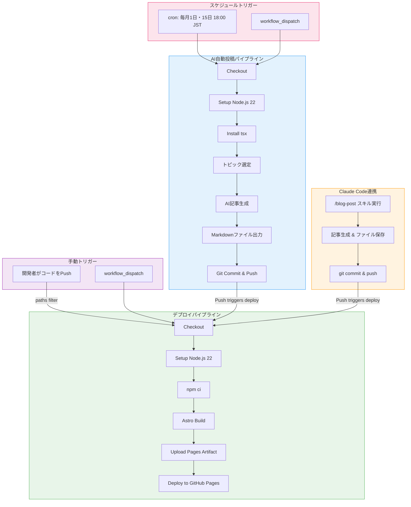
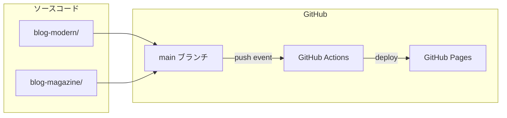
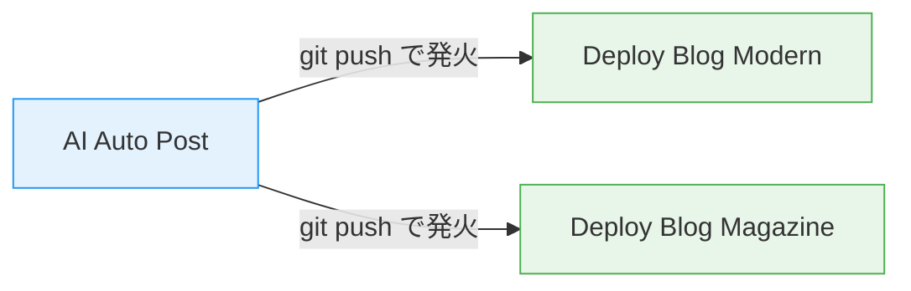
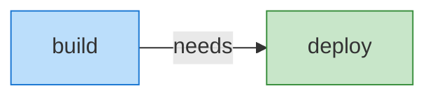
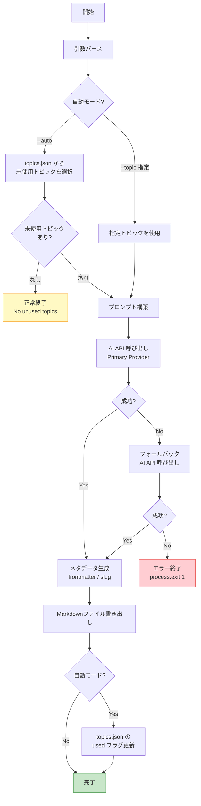
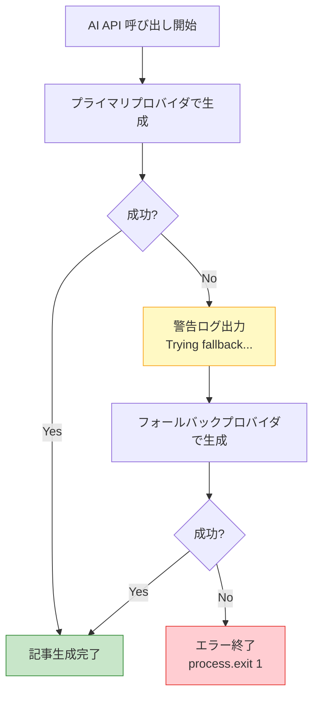
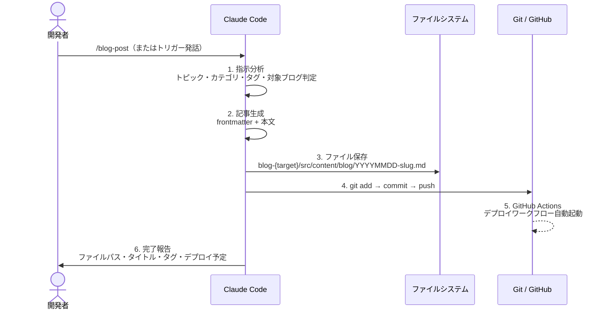
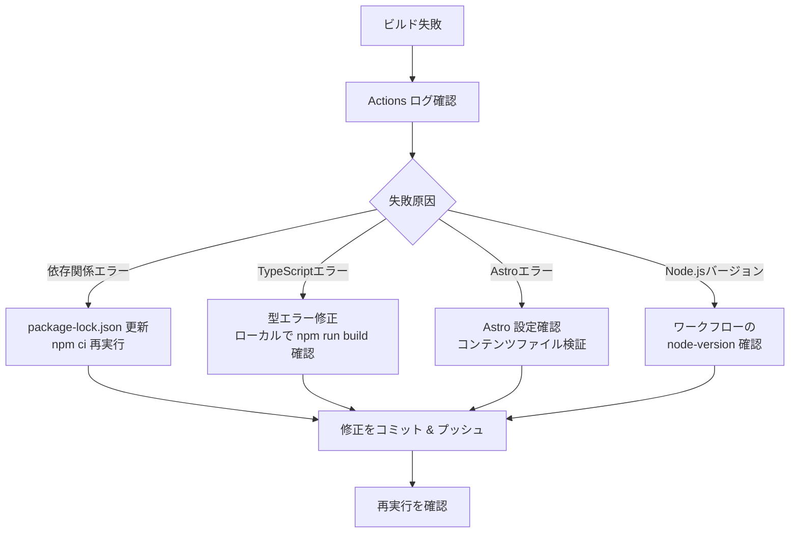
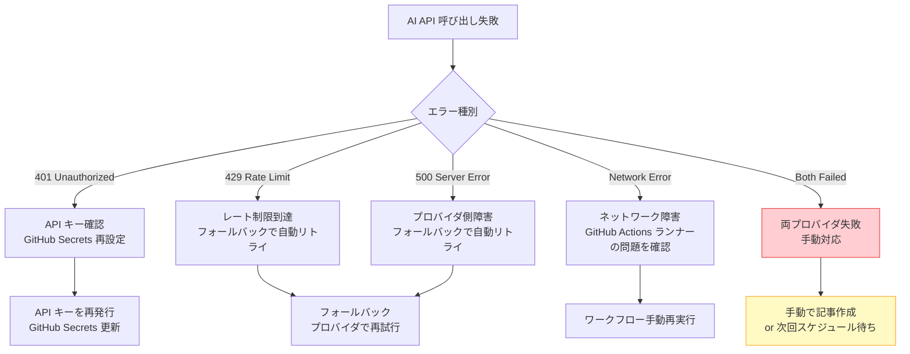

# CI/CD設計書

## 1. ドキュメント情報

| 項目 | 内容 |
|------|------|
| ドキュメント名 | CI/CD設計書 |
| プロジェクト名 | ブログシステム（blog-modern / blog-magazine） |
| バージョン | 1.0.0 |
| 作成日 | 2026-03-02 |
| 最終更新日 | 2026-03-02 |
| 作成者 | インフラチーム |
| ステータス | 初版 |

### 改訂履歴

| バージョン | 日付 | 変更者 | 変更内容 |
|-----------|------|--------|---------|
| 1.0.0 | 2026-03-02 | インフラチーム | 初版作成 |

---

## 2. CI/CDパイプライン概要

### 2.1 システム構成概要

本システムは、Astro フレームワークで構築された2つのブログサイト（blog-modern、blog-magazine）を GitHub Pages に自動デプロイする CI/CD パイプラインと、AI による記事自動生成ワークフローで構成される。

**技術スタック:**

| コンポーネント | 技術 | バージョン |
|--------------|------|-----------|
| 静的サイトジェネレータ | Astro | 5.17.x |
| CSSフレームワーク | Tailwind CSS | 4.2.x |
| ランタイム | Node.js | 22.x |
| CI/CDプラットフォーム | GitHub Actions | - |
| ホスティング | GitHub Pages | - |
| AI記事生成（プライマリ） | Claude API (claude-sonnet-4-20250514) | 2023-06-01 |
| AI記事生成（フォールバック） | OpenAI API (gpt-4o) | - |
| スクリプト実行 | tsx | - |

### 2.2 パイプライン全体フロー



### 2.3 デプロイフロー概念図



---

## 3. ワークフロー一覧

| No. | ワークフロー名 | ファイル | トリガー | 概要 |
|-----|--------------|---------|---------|------|
| 1 | Deploy Blog Modern | `.github/workflows/deploy-modern.yml` | `push` (main, blog-modern/** 変更時) / `workflow_dispatch` | blog-modern をビルドし GitHub Pages へデプロイ |
| 2 | Deploy Blog Magazine | `.github/workflows/deploy-magazine.yml` | `push` (main, blog-magazine/** 変更時) / `workflow_dispatch` | blog-magazine をビルドし GitHub Pages へデプロイ |
| 3 | AI Auto Post | `.github/workflows/ai-auto-post.yml` | `schedule` (毎月1日・15日 09:00 UTC) / `workflow_dispatch` | AIで記事を自動生成しリポジトリにコミット |

### ワークフロー間の依存関係



AI Auto Post ワークフローが記事をコミット＆プッシュすると、変更されたブログのパスに応じてデプロイワークフローが自動的にトリガーされる。

---

## 4. デプロイワークフロー詳細

### 4.1 Deploy Blog Modern

#### 4.1.1 トリガー条件

```yaml
on:
  push:
    branches: [main]
    paths:
      - 'blog-modern/**'
  workflow_dispatch:
```

| 条件 | 説明 |
|------|------|
| ブランチ | `main` ブランチへの push のみ |
| パスフィルタ | `blog-modern/**` 配下のファイルに変更がある場合のみ実行 |
| 手動実行 | `workflow_dispatch` により GitHub UI から手動実行可能 |

#### 4.1.2 ジョブ構成



| ジョブ名 | 実行環境 | 依存ジョブ | 説明 |
|---------|---------|-----------|------|
| `build` | `ubuntu-latest` | なし | ソースコードのチェックアウト、依存関係インストール、Astro ビルド、アーティファクトアップロード |
| `deploy` | `ubuntu-latest` | `build` | GitHub Pages へのデプロイ |

#### 4.1.3 ステップ詳細 - build ジョブ

| No. | ステップ名 | アクション / コマンド | 説明 |
|-----|-----------|---------------------|------|
| 1 | Checkout | `actions/checkout@v4` | リポジトリのソースコードをチェックアウト |
| 2 | Setup Node.js | `actions/setup-node@v4` | Node.js 22 のセットアップ。`blog-modern/package-lock.json` をキャッシュキーとして npm キャッシュを有効化 |
| 3 | Install dependencies | `npm ci` | `blog-modern/` をワーキングディレクトリとして依存関係を厳密インストール |
| 4 | Build Astro site | `npm run build` | Astro による静的サイトビルド。出力先は `blog-modern/dist/` |
| 5 | Upload artifact | `actions/upload-pages-artifact@v3` | ビルド成果物（`blog-modern/dist`）を GitHub Pages アーティファクトとしてアップロード |

#### 4.1.4 ステップ詳細 - deploy ジョブ

| No. | ステップ名 | アクション / コマンド | 説明 |
|-----|-----------|---------------------|------|
| 1 | Deploy to GitHub Pages | `actions/deploy-pages@v4` | アップロード済みアーティファクトを GitHub Pages にデプロイ。デプロイ完了後の URL を出力 |

#### 4.1.5 環境設定

**パーミッション:**

```yaml
permissions:
  contents: read    # リポジトリ読み取り
  pages: write      # GitHub Pages 書き込み
  id-token: write   # OIDC トークン発行（Pages デプロイに必要）
```

**同時実行制御:**

```yaml
concurrency:
  group: pages-modern
  cancel-in-progress: true
```

| 設定 | 値 | 説明 |
|------|-----|------|
| グループ名 | `pages-modern` | 同一グループの実行は直列化される |
| 実行中キャンセル | `true` | 新しい実行が開始されると、進行中の実行をキャンセル |

**デプロイ環境:**

```yaml
environment:
  name: github-pages
  url: ${{ steps.deployment.outputs.page_url }}
```

デプロイ完了後、GitHub リポジトリの Environments セクションにデプロイ URL が記録される。

### 4.2 Deploy Blog Magazine

#### 4.2.1 トリガー条件

```yaml
on:
  push:
    branches: [main]
    paths:
      - 'blog-magazine/**'
  workflow_dispatch:
```

Deploy Blog Modern と同一の構造。パスフィルタが `blog-magazine/**` である点のみ異なる。

#### 4.2.2 ジョブ構成

Deploy Blog Modern と同一構成（`build` -> `deploy`）。

#### 4.2.3 差異一覧

| 項目 | Deploy Blog Modern | Deploy Blog Magazine |
|------|-------------------|---------------------|
| パスフィルタ | `blog-modern/**` | `blog-magazine/**` |
| ワーキングディレクトリ | `blog-modern` | `blog-magazine` |
| キャッシュキー | `blog-modern/package-lock.json` | `blog-magazine/package-lock.json` |
| アーティファクトパス | `blog-modern/dist` | `blog-magazine/dist` |
| 同時実行グループ | `pages-modern` | `pages-magazine` |
| サイトベースパス | `/blog-modern` | `/blog-magazine` |

### 4.3 Astro ビルド設定

各ブログの `astro.config.mjs` における主要設定:

| 設定項目 | blog-modern | blog-magazine |
|---------|-------------|---------------|
| `site` | `https://example.github.io` | `https://example.github.io` |
| `base` | `/blog-modern` | `/blog-magazine` |
| インテグレーション | MDX, Sitemap | MDX, Sitemap |
| CSS | Tailwind CSS 4 (Vite プラグイン) | Tailwind CSS 4 (Vite プラグイン) |
| シンタックスハイライト | Shiki (github-light / github-dark) | Shiki (github-light / github-dark) |

---

## 5. AI自動投稿ワークフロー詳細

### 5.1 ワークフロー概要

AI Auto Post ワークフローは、スケジュールまたは手動トリガーにより AI API を呼び出してブログ記事を自動生成し、リポジトリにコミット・プッシュする。プッシュにより対応するデプロイワークフローが自動的にトリガーされ、生成された記事がブログサイトに公開される。

### 5.2 スケジュール設定

```yaml
schedule:
  - cron: '0 9 1,15 * *'
```

| 項目 | 値 | 説明 |
|------|-----|------|
| cron 式 | `0 9 1,15 * *` | UTC 09:00（JST 18:00）に実行 |
| 実行日 | 毎月 1日、15日 | 月2回の定期投稿 |
| タイムゾーン | UTC（GitHub Actions 標準） | JST 18:00 に相当 |

> **注意:** GitHub Actions の cron スケジュールは UTC 基準で定義される。JST（UTC+9）で18:00に実行するため、UTC 09:00 を指定している。また、GitHub Actions のスケジュール実行は負荷状況により数分〜数十分の遅延が発生する場合がある。

### 5.3 手動トリガー（workflow_dispatch）

```yaml
workflow_dispatch:
  inputs:
    blog:
      description: 'Target blog (modern or magazine)'
      required: true
      default: 'modern'
      type: choice
      options:
        - modern
        - magazine
    topic:
      description: 'Article topic (leave empty for auto-select)'
      required: false
      type: string
    provider:
      description: 'AI provider'
      required: true
      default: 'claude'
      type: choice
      options:
        - claude
        - openai
```

| パラメータ | 型 | 必須 | デフォルト | 説明 |
|-----------|-----|------|-----------|------|
| `blog` | choice | Yes | `modern` | 投稿先ブログ。`modern` または `magazine` |
| `topic` | string | No | （空文字） | 記事トピック。空の場合は `topics.json` から自動選択 |
| `provider` | choice | Yes | `claude` | AI プロバイダ。`claude` または `openai` |

### 5.4 ジョブ構成

| ジョブ名 | 実行環境 | 説明 |
|---------|---------|------|
| `generate` | `ubuntu-latest` | 記事生成、コミット、プッシュを一連で実行 |

**パーミッション:**

```yaml
permissions:
  contents: write  # コミット & プッシュに必要
```

### 5.5 ステップ詳細

| No. | ステップ名 | アクション / コマンド | 説明 |
|-----|-----------|---------------------|------|
| 1 | Checkout | `actions/checkout@v4` | リポジトリをチェックアウト |
| 2 | Setup Node.js | `actions/setup-node@v4` | Node.js 22 をセットアップ |
| 3 | Install tsx | `npm install -g tsx` | TypeScript 実行ランタイム（tsx）をグローバルインストール |
| 4 | Generate post | `tsx scripts/generate-post.ts` | AI API を呼び出して記事を生成（詳細は 5.6 参照） |
| 5 | Commit and push | `git commit` / `git push` | 生成された記事をコミットしてプッシュ |

### 5.6 AI記事生成プロセス

記事生成スクリプト `scripts/generate-post.ts` の処理フローを以下に示す。



#### 5.6.1 トピック管理

トピックは `scripts/topics.json` で管理される。

**データ構造:**

```typescript
interface Topic {
  title: string;      // 記事タイトル
  category: string;   // カテゴリ（AI入門、入門、技術解説 等）
  tags: string[];     // タグ配列
  audience: string;   // 対象読者
  used: boolean;      // 使用済みフラグ
}
```

**自動選択ロジック:**

1. `topics.json` を読み込む
2. `used: false` のトピックをフィルタリング
3. 最初の未使用トピックを選択（配列順）
4. 記事生成後、当該トピックの `used` を `true` に更新

**登録済みトピック（初期状態）:**

| No. | タイトル | カテゴリ | 対象読者 |
|-----|---------|---------|---------|
| 1 | 【新卒向け】生成AIとは？ChatGPTからClaude Codeまで | AI入門 | IT未経験の新卒エンジニア |
| 2 | 【新卒向け】GitHubの使い方 - 初めてのバージョン管理 | 入門 | IT未経験の新卒エンジニア |
| 3 | 【新卒向け】プログラミング学習ロードマップ2026 | AI入門 | IT未経験の新卒エンジニア |
| 4 | Markdown完全ガイド - エンジニアの文書術 | 技術解説 | 若手エンジニア |
| 5 | 【新卒向け】AIを使った効率的な学習方法 | AI入門 | IT未経験の新卒エンジニア |
| 6 | 【新卒向け】コマンドライン入門 - ターミナルの基本操作 | 入門 | IT未経験の新卒エンジニア |
| 7 | GitHub Copilotで変わるコーディング - AIペアプログラミング入門 | AI入門 | 若手エンジニア |
| 8 | 【新卒向け】API入門 - Webサービスの仕組みを理解する | 入門 | IT未経験の新卒エンジニア |
| 9 | Docker入門 - コンテナ技術の基礎を学ぶ | 技術解説 | 若手エンジニア |
| 10 | CI/CD入門 - GitHub Actionsで始める自動化 | 技術解説 | 若手エンジニア |

#### 5.6.2 AI API 呼び出し

**プロンプト構成:**

```
You are a technical blog writer. Write a blog post in Japanese about "{topic}".

Requirements:
- Target audience: {audience}
- Category: {category}
- Write in a friendly, educational tone
- Include code examples where appropriate
- Use Markdown with proper headings (## for H2, ### for H3)
- Include a practical "まとめ" (summary) section at the end
- Total length: 1500-2500 characters
- Do NOT include frontmatter (---) - just the article body starting from ## はじめに
```

**API エンドポイント:**

| プロバイダ | エンドポイント | モデル | 最大トークン |
|-----------|--------------|--------|------------|
| Claude (Anthropic) | `https://api.anthropic.com/v1/messages` | `claude-sonnet-4-20250514` | 4096 |
| OpenAI | `https://api.openai.com/v1/chat/completions` | `gpt-4o` | 4096 |

#### 5.6.3 記事出力形式

**Frontmatter:**

```yaml
---
title: "{トピックタイトル}"
description: "{本文先頭120文字からの抜粋}"
pubDate: YYYY-MM-DD
tags: ["tag1", "tag2", ...]
category: "{カテゴリ}"
draft: false
aiGenerated: true
---
```

**ファイル命名規則:**

- パス: `blog-{modern|magazine}/src/content/blog/{slug}.md`
- slug: `{YYYYMMDD}-{hash}` （日付 + タイトルハッシュ値の Base36 表現先頭6文字）

#### 5.6.4 コミット & プッシュ

```yaml
- name: Commit and push
  run: |
    git config user.name "AI Auto Post"
    git config user.email "ai-bot@users.noreply.github.com"
    git add -A
    if git diff --staged --quiet; then
      echo "No changes to commit"
    else
      git commit -m "feat: auto-generated blog post [ai-post]"
      git push
    fi
```

| 項目 | 値 | 説明 |
|------|-----|------|
| コミッター名 | `AI Auto Post` | bot 用のユーザー名 |
| コミッターメール | `ai-bot@users.noreply.github.com` | bot 用のメールアドレス |
| コミットメッセージ | `feat: auto-generated blog post [ai-post]` | Conventional Commits 準拠 |
| 空コミット防止 | `git diff --staged --quiet` | 変更がない場合はコミットをスキップ |

### 5.7 フォールバック戦略

AI 記事生成におけるフォールバック処理を以下に示す。



| プライマリ設定 | フォールバック先 |
|--------------|----------------|
| `claude` | OpenAI (gpt-4o) |
| `openai` | Claude (claude-sonnet-4-20250514) |

フォールバック発生時のログ出力例:

```
[generate-post] claude failed: Claude API error: 429 {...}. Trying fallback...
```

フォールバックも失敗した場合、スクリプトは `process.exit(1)` で終了し、GitHub Actions ワークフローは失敗ステータスとなる。

---

## 6. Claude Code連携

### 6.1 /blog-post スキル概要

Claude Code の `/blog-post` スキルにより、開発者は対話的にブログ記事を生成・投稿できる。

**スキル定義ファイル:** `.claude/skills/blog-post/SKILL.md`

### 6.2 トリガー条件

以下のいずれかの入力で `/blog-post` スキルが起動する:

- `/blog-post` コマンドの直接実行
- 「ブログ書いて」「ブログ上げて」「記事書いて」等の自然言語指示
- 「今日の作業まとめてブログに」等のコンテキスト指示
- 「このツール紹介しといて」等の特定用途指示

### 6.3 手動投稿フロー



### 6.4 生成記事フォーマット

```markdown
---
title: "記事タイトル"
description: "記事の説明（100-150文字）"
pubDate: YYYY-MM-DD
tags: ["tag1", "tag2", "tag3"]
category: "カテゴリ名"
draft: false
aiGenerated: true
---

## はじめに
（導入文）

## 本文セクション
（内容）

## まとめ
（まとめ）
```

### 6.5 AI自動投稿との比較

| 項目 | AI Auto Post（GitHub Actions） | /blog-post（Claude Code） |
|------|-------------------------------|--------------------------|
| 実行環境 | GitHub Actions ランナー | ローカル開発環境 |
| トリガー | スケジュール / workflow_dispatch | 開発者の対話指示 |
| AI プロバイダ | Claude API / OpenAI API | Claude Code 自体 |
| トピック選定 | topics.json / 手動入力 | 開発者との対話で決定 |
| コミットメッセージ | 定型文 | コンテキストに応じた内容 |
| レビュー | なし（自動） | 開発者が確認後に承認 |
| 用途 | 定期的な自動投稿 | 任意のタイミングでの手動投稿 |

---

## 7. ブランチ戦略

### 7.1 ブランチ運用方針

本プロジェクトでは、シンプルさを重視した **main ブランチ直接運用** を基本方針とする。

```mermaid
gitgraph
    commit id: "initial"
    commit id: "feat: blog post"
    branch feature/new-layout
    commit id: "WIP: layout"
    commit id: "fix: responsive"
    checkout main
    merge feature/new-layout id: "merge"
    commit id: "feat: ai post [ai-post]"
    commit id: "feat: ai post [ai-post] " type: HIGHLIGHT
```

### 7.2 ブランチ種別

| ブランチ | 用途 | 保護ルール |
|---------|------|-----------|
| `main` | 本番デプロイ対象。直接 push 可 | デプロイ対象 |
| `feature/*` | 新機能開発（任意） | PR マージ推奨 |
| `fix/*` | バグ修正（任意） | PR マージ推奨 |

### 7.3 運用上の考慮事項

- AI Auto Post ワークフローは `main` ブランチに直接コミット・プッシュする
- Claude Code の `/blog-post` スキルも `main` ブランチに直接プッシュする
- サイト構造やテンプレートの変更など、影響範囲が大きい変更は feature ブランチでの作業を推奨
- PR 前には lint、typecheck、test を通すこと（プロジェクト規約準拠）

---

## 8. シークレット管理

### 8.1 GitHub Secrets 一覧

| シークレット名 | 用途 | 使用ワークフロー | 必須 |
|--------------|------|----------------|------|
| `ANTHROPIC_API_KEY` | Claude API 認証キー | AI Auto Post | Yes（claude プロバイダ使用時） |
| `OPENAI_API_KEY` | OpenAI API 認証キー | AI Auto Post | Yes（openai プロバイダ使用時 / フォールバック用） |

### 8.2 シークレット設定箇所

GitHub リポジトリの `Settings` > `Secrets and variables` > `Actions` に設定する。

### 8.3 シークレットの参照方法

```yaml
env:
  ANTHROPIC_API_KEY: ${{ secrets.ANTHROPIC_API_KEY }}
  OPENAI_API_KEY: ${{ secrets.OPENAI_API_KEY }}
```

### 8.4 セキュリティ上の注意事項

| 項目 | 対応方針 |
|------|---------|
| シークレットのログ出力 | GitHub Actions はシークレット値を自動マスクする |
| フォーク先での実行 | フォークリポジトリからの PR ではシークレットにアクセスできない |
| ローテーション | API キーは定期的にローテーションすることを推奨 |
| 最小権限 | API キーは記事生成に必要な最小限の権限のみ付与する |

### 8.5 OIDC トークン（GitHub Pages デプロイ）

デプロイワークフローでは `id-token: write` パーミッションにより OIDC トークンを発行し、GitHub Pages へのデプロイ認証に使用する。このトークンはワークフロー実行ごとに自動生成・自動失効するため、手動でのシークレット管理は不要である。

---

## 9. 監視・通知

### 9.1 GitHub Actions 標準通知

GitHub Actions の標準機能により、以下のタイミングで通知が送信される。

| イベント | 通知先 | 条件 |
|---------|--------|------|
| ワークフロー失敗 | リポジトリ Watch ユーザー | デフォルトで有効 |
| デプロイ完了 | GitHub Deployments | environment 設定時に自動記録 |

### 9.2 通知設定

GitHub リポジトリの `Settings` > `Actions` > `Notifications` で以下を設定する:

- **ワークフロー失敗時の通知**: リポジトリ管理者のメールアドレスに送信
- **通知頻度**: 各ワークフロー失敗時に即座に通知

### 9.3 監視対象項目

| 監視項目 | 確認方法 | 確認頻度 |
|---------|---------|---------|
| デプロイワークフロー成功率 | GitHub Actions ダッシュボード | Push 毎 |
| AI Auto Post 実行状況 | GitHub Actions ダッシュボード | 毎月 1日・15日 |
| topics.json の残りトピック数 | リポジトリ内ファイル確認 | 月次 |
| API キーの有効期限 | 各プロバイダの管理画面 | 月次 |
| GitHub Pages デプロイステータス | リポジトリ Environments | デプロイ毎 |

### 9.4 ログ確認

各ワークフロー実行のログは、GitHub リポジトリの `Actions` タブから確認可能。AI Auto Post ワークフローのログには以下の情報が出力される:

```
[generate-post] blog=modern, auto=true, provider=claude
[generate-post] Auto-selected topic: "【新卒向け】生成AIとは？ChatGPTからClaude Codeまで"
[generate-post] Calling claude API...
[generate-post] Created: /path/to/blog-modern/src/content/blog/20260301-abc123.md
[generate-post] Marked topic "【新卒向け】生成AIとは？ChatGPTからClaude Codeまで" as used.
```

---

## 10. 障害対応

### 10.1 障害分類と対応手順

#### 10.1.1 ビルド失敗



| 失敗パターン | 想定原因 | 対応手順 |
|-------------|---------|---------|
| `npm ci` 失敗 | `package-lock.json` と `package.json` の不整合 | ローカルで `npm install` を実行し `package-lock.json` を再生成してコミット |
| Astro ビルドエラー | 不正な Markdown / frontmatter | エラーログで対象ファイルを特定し、frontmatter の YAML 構文を修正 |
| メモリ不足 | ランナーのメモリ制限超過 | `NODE_OPTIONS=--max-old-space-size=4096` を環境変数に追加 |

#### 10.1.2 デプロイ失敗

| 失敗パターン | 想定原因 | 対応手順 |
|-------------|---------|---------|
| Pages デプロイエラー | GitHub Pages の設定不備 | リポジトリ Settings > Pages で Source が「GitHub Actions」に設定されているか確認 |
| パーミッションエラー | OIDC トークン発行失敗 | ワークフローの `permissions` に `id-token: write` が含まれているか確認 |
| アーティファクト未検出 | build ジョブの失敗 | build ジョブのログを確認し、アーティファクトが正常にアップロードされているか確認 |
| 同時実行競合 | 複数デプロイの衝突 | `concurrency` 設定により自動解消されるが、頻発する場合は push 頻度を調整 |

**手動再デプロイ手順:**

1. GitHub リポジトリの `Actions` タブを開く
2. 対象のデプロイワークフローを選択
3. `Run workflow` ボタンから `main` ブランチを指定して手動実行

#### 10.1.3 AI API 失敗



| 失敗パターン | 想定原因 | 自動対応 | 手動対応 |
|-------------|---------|---------|---------|
| プライマリ API 失敗 | レート制限 / サーバーエラー | フォールバックプロバイダで自動リトライ | - |
| 両 API 失敗 | 全プロバイダ障害 / キー無効 | なし（`exit 1`） | API キー確認後、手動再実行 |
| トピック枯渇 | `topics.json` の全トピック使用済み | 正常終了（`exit 0`、コミットなし） | `topics.json` に新規トピックを追加 |

#### 10.1.4 コミット & プッシュ失敗

| 失敗パターン | 想定原因 | 対応手順 |
|-------------|---------|---------|
| push 拒否 | ブランチ保護ルール | リポジトリ Settings でブランチ保護ルールを確認。bot ユーザーに push 権限を付与 |
| コンフリクト | 同時実行による競合 | `concurrency` 設定の確認。必要に応じて `cancel-in-progress` を調整 |
| 認証失敗 | `GITHUB_TOKEN` の権限不足 | ワークフローの `permissions.contents: write` を確認 |

### 10.2 エスカレーション基準

| 対応レベル | 条件 | 対応者 |
|-----------|------|--------|
| L1: 自動復旧 | フォールバックで成功 | 不要（自動） |
| L2: 手動再実行 | 一時的なエラー（ネットワーク等） | 開発担当者 |
| L3: 設定修正 | API キー期限切れ / 設定不備 | インフラ担当者 |
| L4: 構成変更 | ワークフロー定義の修正が必要 | プロジェクトリーダー |

---

## 付録

### A. ファイル構成

```
power-test1/
├── .github/
│   └── workflows/
│       ├── deploy-modern.yml      # blog-modern デプロイ
│       ├── deploy-magazine.yml    # blog-magazine デプロイ
│       └── ai-auto-post.yml      # AI 自動投稿
├── .claude/
│   └── skills/
│       └── blog-post/
│           └── SKILL.md           # /blog-post スキル定義
├── scripts/
│   ├── generate-post.ts           # AI 記事生成スクリプト
│   └── topics.json                # トピック管理ファイル
├── blog-modern/
│   ├── astro.config.mjs           # Astro 設定（base: /blog-modern）
│   ├── package.json               # 依存関係定義
│   └── src/
│       └── content/
│           └── blog/              # 記事格納ディレクトリ
├── blog-magazine/
│   ├── astro.config.mjs           # Astro 設定（base: /blog-magazine）
│   ├── package.json               # 依存関係定義
│   └── src/
│       └── content/
│           └── blog/              # 記事格納ディレクトリ
└── docs/
    └── cicd-design.md             # 本ドキュメント
```

### B. GitHub Actions で使用するアクション一覧

| アクション | バージョン | 用途 |
|-----------|-----------|------|
| `actions/checkout` | v4 | リポジトリチェックアウト |
| `actions/setup-node` | v4 | Node.js セットアップ |
| `actions/upload-pages-artifact` | v3 | Pages アーティファクトアップロード |
| `actions/deploy-pages` | v4 | GitHub Pages デプロイ |

### C. 用語集

| 用語 | 説明 |
|------|------|
| Astro | 高速な静的サイトジェネレータ。コンテンツ重視のサイト構築に最適化 |
| GitHub Pages | GitHub が提供する静的サイトホスティングサービス |
| GitHub Actions | GitHub が提供する CI/CD プラットフォーム |
| workflow_dispatch | GitHub Actions のワークフローを手動でトリガーする機能 |
| Conventional Commits | コミットメッセージの標準化規約（feat:, fix: 等） |
| OIDC | OpenID Connect。GitHub Actions から外部サービスへの安全な認証プロトコル |
| frontmatter | Markdown ファイル冒頭のメタデータ定義部分（YAML 形式） |
| tsx | TypeScript を直接実行するためのランタイム |
| Claude Code | Anthropic が提供する CLI ベースの AI コーディングツール |

---

*以上*
